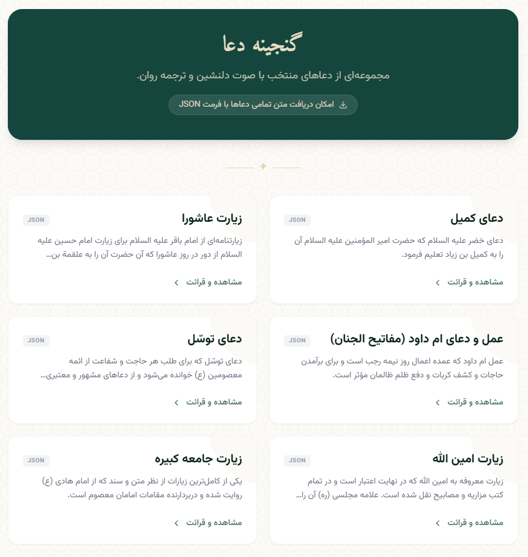
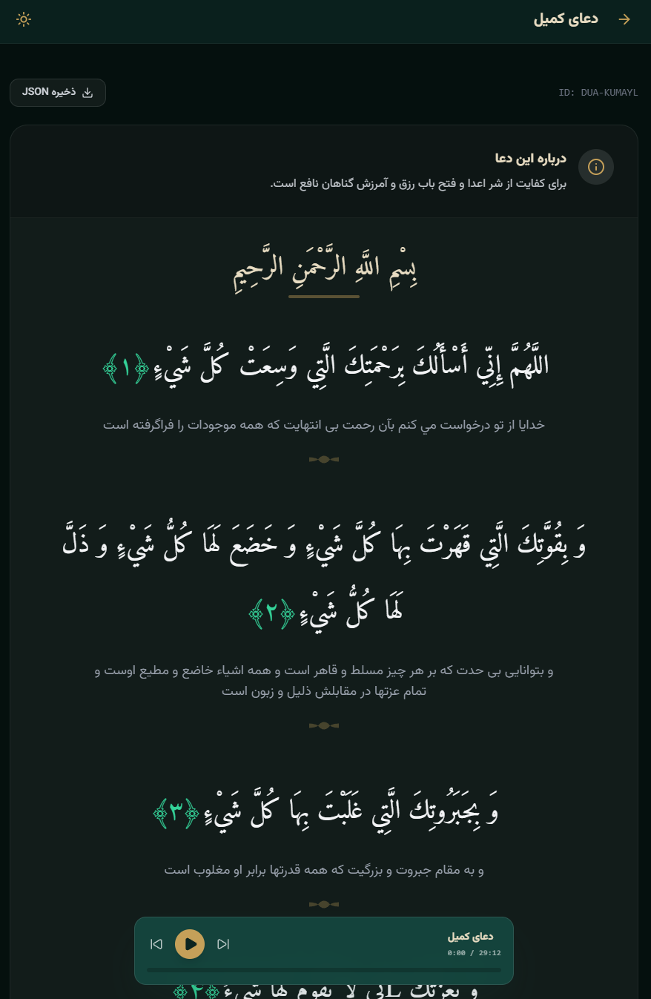

# گنجینه دعا | Dua Treasury 🌙

[](https://react.dev/)
[](https://www.typescriptlang.org/)
[](https://vitejs.dev/)
[](LICENSE)

[**مشاهده دموی زنده | Live Demo**](https://tje3d.github.io/dua-treasury/)

[English](#english) | [فارسی](#persian)

---

<a name="persian"></a>

## فارسی

[**🚀 مشاهده آنلاین پروژه**](https://tje3d.github.io/dua-treasury/)

گنجینه دعا یک نرم‌افزار متن‌باز و مدرن برای دسترسی به ادعیه و زیارات شیعی است. این پروژه با تمرکز بر تجربه کاربری زیبا، سرعت بالا و قابلیت دسترسی آفلاین (در آینده) طراحی شده است.

### 🌟 ویژگی‌ها

- **طراحی مدرن و معنوی:** استفاده از تایپوگرافی مناسب (وزیر و امیری) و المان‌های اسلیمی.
- **حالت شب و روز:** پشتیبانی کامل از حالت تاریک برای مطالعه راحت‌تر در شب.
- **پخش صوتی:** امکان شنیدن صوت ادعیه با صدای مداحان برجسته.
- **ترجمه روان:** نمایش ترجمه فارسی در کنار متن عربی.
- **خروجی JSON:** امکان دانلود متن هر دعا به صورت فایل JSON برای استفاده در پروژه‌های دیگر.
- **واکنش‌گرا (Responsive):** نمایش بهینه در تمامی دستگاه‌ها (موبایل، تبلت و دسکتاپ).

### 📸 تصاویر پروژه
<div align="center">
  
  
</div>

### 🛠 تکنولوژی‌های مورد استفاده

- **React 19**: کتابخانه قدرتمند رابط کاربری.
- **Vite**: ابزار ساخت سریع و مدرن.
- **Tailwind CSS**: برای طراحی استایل‌های زیبا و انعطاف‌پذیر.
- **TypeScript**: برای افزایش پایداری و دقت در کدنویسی.
- **Lucide React**: مجموعه آیکون‌های زیبا و سبک.
- **React Router**: برای مدیریت مسیرها در برنامه.

### 🚀 نصب و راه‌اندازی

برای اجرای پروژه در محیط محلی، مراحل زیر را دنبال کنید:

1. مخزن را کلون کنید:
   ```bash
   git clone https://github.com/tje3d/dua-treasury.git
   ```
2. وارد پوشه پروژه شوید:
   ```bash
   cd dua-treasury
   ```
3. بسته‌ها را نصب کنید (پیشنهاد می‌شود از `bun` استفاده کنید):
   ```bash
   bun install
   ```
4. پروژه را اجرا کنید:
   ```bash
   bun run dev
   ```

### 🤝 مشارکت

ما از مشارکت شما برای بهبود این پروژه استقبال می‌کنیم! شما می‌توانید با افزودن دعاهای جدید، بهبود رابط کاربری یا گزارش خطاها به ما کمک کنید.

---

<a name="english"></a>

## English

[**🚀 View Live Demo**](https://tje3d.github.io/dua-treasury/)

Dua Treasury is an open-source, modern web application for accessing Shia supplications (Duas) and Ziyarats. This project focuses on providing a beautiful user experience, high performance, and ease of use.

### 🌟 Features

- **Modern & Spiritual Design:** Utilizing elegant typography (Vazirmatn & Amiri) and Islamic patterns.
- **Dark & Light Mode:** Full support for dark mode for comfortable reading at night.
- **Audio Playback:** Listen to beautiful recitations for each prayer.
- **Fluent Translation:** Persian translations alongside the original Arabic text.
- **JSON Export:** Ability to download each prayer's content as a JSON file for use in other projects.
- **Fully Responsive:** Optimized for all screen sizes (Mobile, Tablet, Desktop).

### 📸 Screenshots
<div align="center">
  
  
</div>

### 🛠 Tech Stack

- **React 19**: Modern UI library.
- **Vite**: Next-generation frontend tooling.
- **Tailwind CSS**: For utility-first styling.
- **TypeScript**: Ensuring type safety and better developer experience.
- **Lucide React**: For beautiful and lightweight icons.
- **React Router**: For seamless navigation.

### 🚀 Getting Started

To run this project locally, follow these steps:

1. Clone the repository:
   ```bash
   git clone https://github.com/tje3d/dua-treasury.git
   ```
2. Navigate to the project folder:
   ```bash
   cd dua-treasury
   ```
3. Install dependencies (recommended to use `bun`):
   ```bash
   bun install
   ```
4. Start the development server:
   ```bash
   bun run dev
   ```

### 🤝 Contributing

Contributions are welcome! Whether it's adding new prayers, improving the UI, or reporting bugs, feel free to open an issue or submit a pull request.

---

**Developed with ❤️ for the community.**
